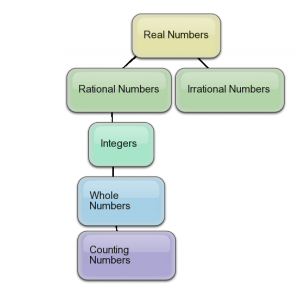
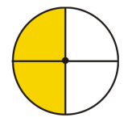

<!DOCTYPE html>
<html><head>
        <title>Host Payara</title>
        <meta http-equiv="Content-Type" content="text/html; charset=UTF-8">
    </head>
    <body>
        

             <h1>1.1 Integers and Rational Numbers</h1>
             
Integers and rational numbers are important in daily life. The price per square yard of carpet is a rational number.
The number of frogs in a pond is expressed using an integer. The organization of real numbers can be drawn as a
hierarchy. Look at the hierarchy below.

             <!-- graphic  -->
        

        

            
The most generic number is the real number; it can be a combination of negative, positive, decimal, fraction, or
                non-repeating decimal values. Real numbers have two major categories: rational numbers and irrational numbers.

                

                <b>Definition:</b>
                √ Irrational numbers are numbers that can be written as non-repeating, non-terminating decimals such
                as π or 2.

                

                <b>Definition:</b> Rational numbers are numbers that can be written in the form ab , where a and b are integers and b 6= 0.
                All Irrational Numbers and Rational Numbers are Real Numbers

                

                <b>Definition:</b> Integers are all the whole numbers, zero and the negatives of the whole numbers. i.e. {. . . -5, -4, -3, -2,
                -1, 0, 1, 2, 3, 4, 5. . . } All Integers are Rational Numbers.

                

                <b>Definition:</b> Whole Numbers are all Counting Numbers and the number zero. i.e. {0, 1, 2, 3, 4, 5. . . } All Whole
                Numbers are Integer.

                

                <b>Definition:</b> Counting Numbers are the the natural numbers from 1 to infinity. i.e. {1, 2, 3, 4, 5. . . } All Counting
                Numbers are Whole Numbers.

        

        

            <h2 style="color: orangered">A Review of Fractions</h2>
            
You can think of a rational number as a fraction of a 
cake. If you cut the cake into b slices, your share is a of those
                slices. For example, when we see the rational number 21 ,
 we imagine cutting the cake into two parts. Our share is
                one of those parts. Visually, the rational number 12 
looks like this.

        

        

            
        

        

            
There are two main types of fractions:

            
• Proper fractions are rational numbers where the numerator is less than the denominator. A proper fraction
                represents a number less than one. With a proper fraction you always end up with less than a whole cake!

                

                • Improper fractions are rational numbers where the numerator is greater than or equal to the denominator.
                Improper fractions can be rewritten as a mixed number – an integer plus a proper fraction. An improper
                fraction represents a number greater than or equal to one.

                

                When evaluating fractions, it is possible for two 
fractions to give the same numerical value. These fractions are
                called equivalent fractions. For example, look at a 
visual representation of the rational number 24 .

        

        

            
    

</body></html>